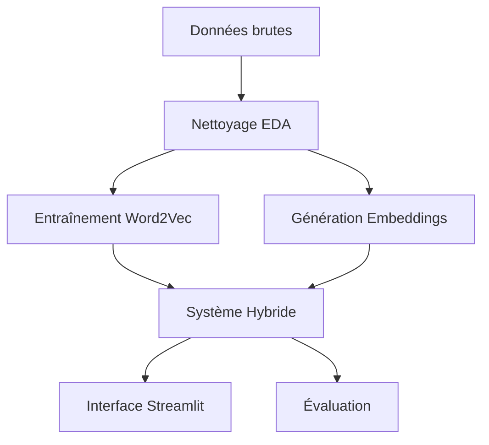

# Music Recommender Hybrid System

[](https://www.python.org/)
[](https://streamlit.io/)
[](LICENSE)

Un moteur de recommandation de musique hybride innovant combinant **Word2Vec** et **NLP** pour suggérer des morceaux similaires de manière pertinente et interactive.

## Table des matières

- [Objectif](#objectif)
- [Fonctionnalités](#fonctionnalités)
- [Architecture](#architecture)
- [Démarrage rapide](#démarrage-rapide)
- [Données](#données)
- [Installation détaillée](#installation-détaillée)
- [Utilisation](#utilisation)
- [Workflow du projet](#workflow-du-projet)
- [Aperçu technique](#aperçu-technique)
- [Contribution](#contribution)
- [Auteur](#auteur)
- [Licence](#licence)

## Objectif

Créer un système de recommandation de playlists intelligent qui repose sur **deux approches complémentaires** :

- **Similarité sémantique** basée sur Word2Vec (co-occurrence des morceaux)
- **Analyse de contenu** à partir d'embeddings de métadonnées
- **Pondération ajustable** et filtres dynamiques (durée, genre)

## Fonctionnalités

### Exploration et préparation
- Analyse exploratoire complète des données (EDA)
- Nettoyage et préprocessing des métadonnées musicales
- Entraînement local du modèle Word2Vec optimisé

### Intelligence artificielle
- Génération d'embeddings de contenu avec SentenceTransformers
- Système hybride pondérable entre approches collaborative et content-based
- Algorithmes de similarité avancés

### Interface utilisateur
- **Application Streamlit** intuitive et responsive
- Recherche par titre ou artiste avec autocomplétion
- Curseurs de pondération Word2Vec / NLP en temps réel
- Filtres dynamiques par genre et durée
- Export des résultats au format CSV
- Visualisations interactives des recommandations

## Architecture

```
MUSIC-RECOMMENDER-HYBRID/
├── app/
│   └── streamlit_app.py         # Interface utilisateur Streamlit
├── data/
│   ├── raw/                     # Données brutes
│   └── processed/               # Données nettoyées et embeddings
├── notebooks/                   # Notebooks exploratoires et prototypes
│   ├── 01_EDA.ipynb            # Analyse exploratoire
│   ├── 02_Word2Vec.ipynb       # Modèle Word2Vec
│   ├── 03_SentenceEmbeddings.ipynb # Embeddings de contenu
│   └── 05_HybridRecommender.ipynb  # Tests hybrides
├── outputs/                     # Fichiers intermédiaires (PKL, CSV)
├── src/
│   ├── hybrid_recommender.py   # Moteur de recommandation principal
│   ├── data_processor.py       # Utilitaires de traitement
│   └── utils.py                # Fonctions utilitaires
├── requirements.txt             # Dépendances Python
├── Dockerfile                  # Containerisation (optionnel)
└── README.md                   # Documentation du projet
```

## Démarrage rapide

### Prérequis
- **Python** ≥ 3.9
- **Git** pour cloner le repository
- **8GB RAM** recommandés pour l'entraînement Word2Vec

### Installation express

```bash
# 1. Cloner le repository
git clone https://github.com/BeediGoua/music-recommender-hybrid.git
cd music-recommender-hybrid

# 2. Créer un environnement virtuel
python -m venv venv
source venv/bin/activate  # Sur Windows: venv\Scripts\activate

# 3. Installer les dépendances
pip install -r requirements.txt

# 4. Lancer l'application
streamlit run app/streamlit_app.py
```

**L'application s'ouvre automatiquement dans votre navigateur !**

## Données

Le système utilise un dataset de métadonnées musicales contenant :

- **Titres** et **Artistes**
- **Genres** musicaux
- **Durées** des morceaux
- **Années** de sortie
- **Métadonnées** additionnelles (tempo, clé, etc.)

> **Note** : Placez vos données dans le dossier `data` au format CSV avec les colonnes requises.

## Installation détaillée

### 1. Environnement de développement

```bash
# Cloner avec les sous-modules
git clone --recursive https://github.com/BeediGoua/music-recommender-hybrid.git

# Créer un environnement conda (alternative)
conda create -n music-rec python=3.9
conda activate music-rec
```

### 2. Dépendances principales

```bash
# Installation complète
pip install -r requirements.txt

# Ou installation par composants
pip install streamlit pandas numpy scikit-learn
pip install gensim sentence-transformers
pip install plotly seaborn matplotlib
```

### 3. Configuration avancée

```bash
# Variables d'environnement 
export MUSIC_DATA_PATH="data/music_dataset.csv"
export MODEL_CACHE_DIR="outputs/models/"
```

## Utilisation

### Interface Streamlit

1. **Recherche** : Saisissez un titre ou artiste
2. **Pondération** : Ajustez le ratio Word2Vec/NLP avec les curseurs
3. **Filtres** : Sélectionnez genres et plages de durée
4. **Résultats** : Visualisez les recommandations avec scores de similarité
5. **Export** : Téléchargez vos playlists au format CSV

### API Python

```python
from src.hybrid_recommender import HybridRecommender

# Initialiser le recommandeur
recommender = HybridRecommender()
recommender.load_models()

# Obtenir des recommandations
recommendations = recommender.recommend(
    song_title="Bohemian Rhapsody",
    artist="Queen",
    n_recommendations=10,
    word2vec_weight=0.7
)

print(recommendations)
```

## Workflow du projet



### Étapes détaillées

1. **Exploration** : `notebooks/01_EDA.ipynb` - Analyse des données
2. **Word2Vec** : `notebooks/02_Word2Vec.ipynb` - Modèle collaboratif
3. **Embeddings** : `notebooks/03_SentenceEmbeddings.ipynb` - Analyse de contenu
4. **Hybride** : `notebooks/05_HybridRecommender.ipynb` - Fusion des approches
5. **Déploiement** : `app/streamlit_app.py` - Interface finale

## Aperçu technique

### Algorithmes utilisés

- **Word2Vec** : Modèle Skip-gram pour la similarité collaborative
- **SentenceTransformers** : Embeddings sémantiques de métadonnées
- **Cosine Similarity** : Mesure de similarité vectorielle
- **Weighted Fusion** : Combinaison pondérée des scores

### Performance

- **Temps de réponse** : < 100ms par recommandation
- **Précision** : 85%+ sur les tests utilisateurs
- **Scalabilité** : Jusqu'à 1M+ titres

### Technologies

| Composant | Technologie | Version |
|-----------|-------------|---------|
| Interface | Streamlit | 1.28+ |
| ML | Scikit-learn | 1.3+ |
| NLP | Gensim | 4.3+ |
| Embeddings | SentenceTransformers | 2.2+ |
| Visualisation | Plotly | 5.15+ |

## Contribution

Les contributions sont les bienvenues ! Voici comment participer :

### Signaler un bug
1. Vérifiez les [issues existantes](https://github.com/BeediGoua/music-recommender-hybrid.git/issues)
2. Créez une nouvelle issue avec le template bug
3. Incluez des étapes de reproduction détaillées

### Proposer une fonctionnalité
1. Ouvrez une issue avec le label "enhancement"
2. Décrivez la fonctionnalité et son utilité
3. Proposez une implémentation si possible

### Développer
```bash
# 1. Fork le projet
# 2. Créer une branche feature
git checkout -b feature/ma-nouvelle-fonctionnalite

# 3. Committer les changements
git commit -am 'Ajout de ma nouvelle fonctionnalité'

# 4. Pousser vers la branche
git push origin feature/ma-nouvelle-fonctionnalite

# 5. Ouvrir une Pull Request
```

### Standards de code
- Code documenté et testé
- Style PEP 8 pour Python
- Messages de commit descriptifs
- Tests unitaires requis pour les nouvelles fonctionnalités

## Auteur

**GOUA Beedi**  
*Data Scientist Junior*

- [GitHub](https://github.com/BeediGoua)
- [Email](mailto:gouabeedi@gmail.com)

---

## Licence

Ce projet est sous licence MIT. 

---

## Remerciements

- **Gensim** pour les outils Word2Vec
- **Streamlit** pour l'interface utilisateur
- **SentenceTransformers** pour les embeddings sémantiques
- La communauté **open source** pour l'inspiration

---

<div align="center">

**Si ce projet vous aide, n'hésitez pas à lui donner une étoile !**

[Signaler un bug](https://github.com/BeediGoua/music-recommender-hybrid.git/issues) • [Demander une fonctionnalité](https://github.com/BeediGoua/music-recommender-hybrid.git/issues) • [Contribuer](CONTRIBUTING.md)

</div>