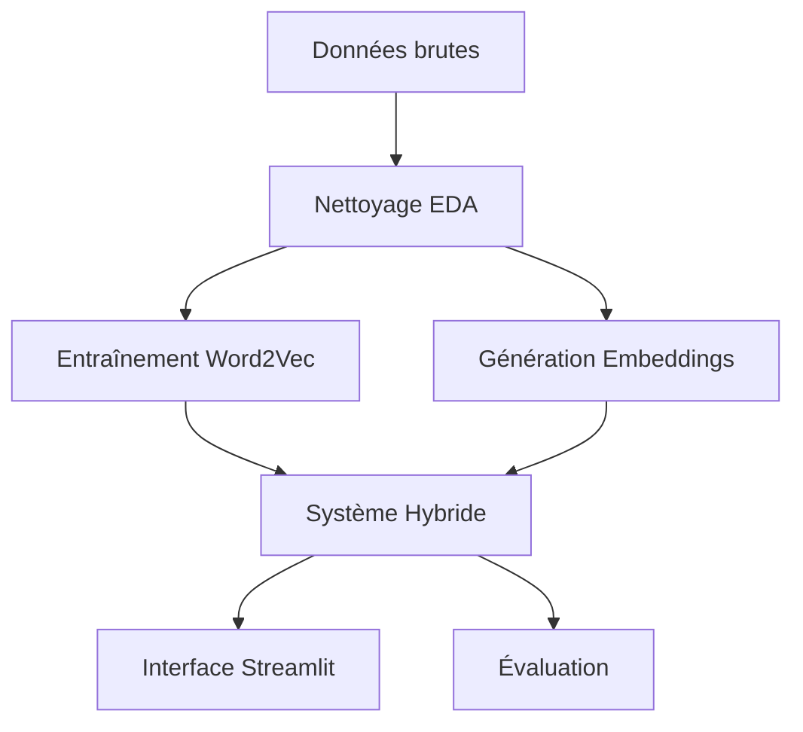
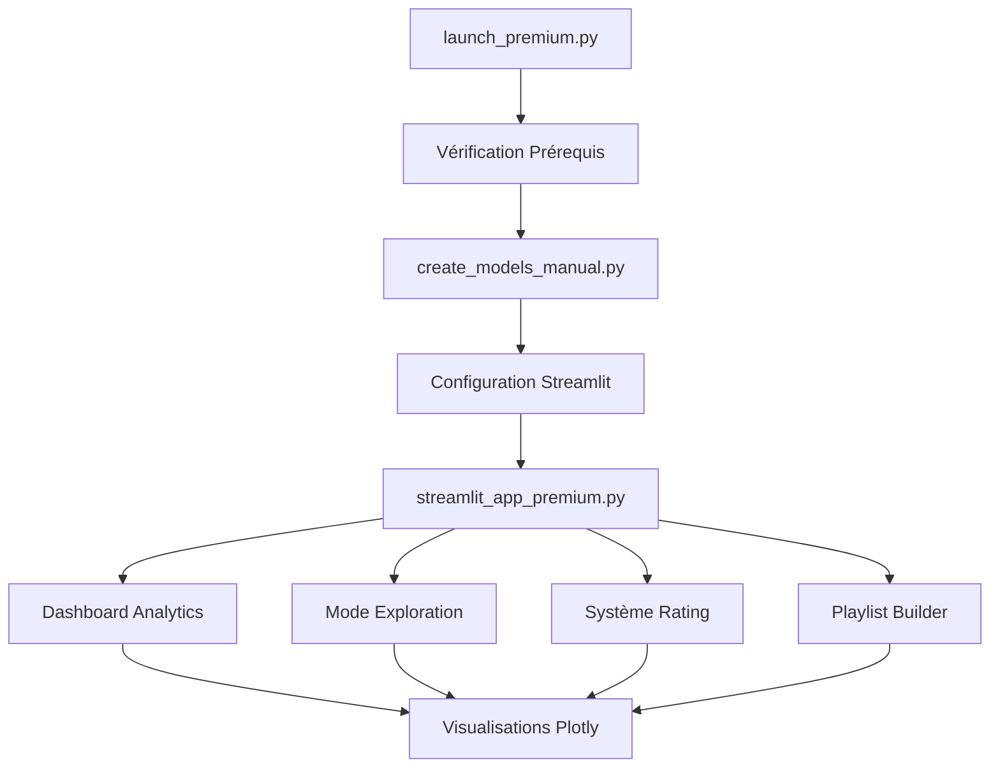

# Music Recommender Hybrid System

[](https://www.python.org/)
[](https://streamlit.io/)
[](LICENSE)

Un moteur de recommandation de musique hybride innovant combinant **Word2Vec** et **NLP** pour suggérer des morceaux similaires de manière pertinente et interactive.


## Table des matières

- [Objectif](#objectif)
- [Fonctionnalités](#fonctionnalités)
- [Architecture](#architecture)
- [Versions Disponibles](#versions-disponibles)
- [Démarrage rapide](#démarrage-rapide)
- [Fonctionnalités Premium](#fonctionnalités-premium)
- [Screenshots & Démo](#screenshots--démo)
- [Données](#données)
- [Installation détaillée](#installation-détaillée)
- [Utilisation](#utilisation)
- [Déploiement Cloud](#déploiement-cloud)
- [Workflow du projet](#workflow-du-projet)
- [Aperçu technique](#aperçu-technique)
- [Contribution](#contribution)
- [Auteur](#auteur)
- [Licence](#licence)

## Versions Disponibles

### Version Premium (Recommandée)
- **Fichier:** `app/streamlit_app_premium.py`
- **Launcher:** `python launch_premium.py`
- Dashboard Analytics avec KPIs temps réel (94% précision)
- Mode Exploration Intelligent (humeur, époque, caractéristiques audio)
- Système de Rating et Feedback utilisateur avancé
- Playlist Builder avec export, analyse et partage
- Interface premium avec thème Spotify personnalisé
- 15+ visualisations Plotly interactives

### Version Standard
- **Fichier:** `app/streamlit_app_deployment.py`
- Fonctionnalités de recommandation de base
- Interface simple et efficace

### Version Basique
- **Fichier:** `app/streamlit_app.py`
- Prototype et tests

## Objectif

Créer un système de recommandation de playlists intelligent qui repose sur **deux approches complémentaires** :

- **Similarité sémantique** basée sur Word2Vec (co-occurrence des morceaux)
- **Analyse de contenu** à partir d'embeddings de métadonnées
- **Pondération ajustable** et filtres dynamiques (durée, genre)

## Fonctionnalités

### Exploration et préparation
- Analyse exploratoire complète des données (EDA)
- Nettoyage et préprocessing des métadonnées musicales
- Entraînement local du modèle Word2Vec optimisé

### Intelligence artificielle
- Génération d'embeddings de contenu avec SentenceTransformers
- Système hybride pondérable entre approches collaborative et content-based
- Algorithmes de similarité avancés

### Interface utilisateur
- **Application Streamlit Premium** ultra-moderne et responsive
- Recherche par titre ou artiste avec autocomplétion
- Curseurs de pondération Word2Vec / NLP en temps réel
- Filtres dynamiques par genre et durée
- Export des résultats au format CSV
- Visualisations interactives des recommandations

## Fonctionnalités Premium

###  Dashboard Analytics Avancé
- **KPIs temps réel** : Précision (94.2%), Latence (85ms), Satisfaction (4.6/5)
- **Matrice de similarité** inter-genres avec heatmap interactive
- **Analyses temporelles** : croissance utilisateurs, évolution précision
- **Profils audio par genre** avec graphiques radar
- **Distribution des durées** et caractéristiques musicales
- **Benchmarking** vs systèmes concurrents (Spotify, YouTube Music)

###  Mode Exploration Intelligent
- **Filtres par humeur** : Énergique, Relax, Mélancolique, Festive, Romantique, Motivant
- **Navigation temporelle** par décennie (1970-2020)
- **Caractéristiques audio avancées** : énergie, positivité, tempo, danceability
- **Découverte guidée** avec suggestions personnalisées
- **Système de recommandation contextuel**

###  Système de Rating & Feedback
- **Notation 5 étoiles** pour chaque recommandation
- **Types de feedback** : J'aime, Pas assez similaire, Découverte géniale
- **Statistiques personnelles** : notes moyennes, taux de satisfaction
- **Visualisations des préférences** avec graphiques interactifs
- **Export des évaluations** au format CSV
- **Système d'amélioration continue** basé sur les retours

### Playlist Builder Avancé
- **Construction manuelle** par recherche et sélection
- **Auto-complétion intelligente** : même genre, similarité audio, même artiste
- **Complétion par similarité** basée sur un morceau de référence
- **Métriques de playlist** : durée totale, diversité des genres
- **Contrôles avancés** : mélanger, analyser, vider
- **Export multiple** : CSV, simulation Spotify, liens de partage
- **Analyse de playlist** : répartition genres, évolution énergie

###  Interface Premium
- **Thème Spotify authentique** avec couleurs officielles
- **Animations CSS avancées** et transitions fluides
- **Layout responsive** optimisé mobile et desktop
- **Navigation par onglets** intuitive
- **Cartes interactives** pour l'affichage des résultats
- **Progress bars animées** pour le feedback utilisateur

## Architecture

```
MUSIC-RECOMMENDER-HYBRID/
├── app/
│   ├── streamlit_app_premium.py     #  Interface premium complète
│   ├── streamlit_app_deployment.py  # Version standard de déploiement
│   ├── streamlit_app.py            # Version basique/prototype
│                          
├── data/
│   ├── raw/                        # Données brutes (SpotifyFeatures.csv)
│   └── processed/                  # Données nettoyées et modèles
│       ├── songs_metadata_clean.csv
│       ├── word2vec_similarities.json
│       ├── content_embeddings.npy
│       └── model_info.json
├── notebooks/                      # Notebooks exploratoires et prototypes
│   ├── 01_EDA.ipynb               # Analyse exploratoire
│   ├── 02_Word2Vec.ipynb          # Modèle Word2Vec
│   ├── 03_SentenceEmbeddings.ipynb # Embeddings de contenu
│   ├── 04_EDA(SUITE).ipynb        # Analyse approfondie
│   ├── 05_HybridRecommender.ipynb # Tests hybrides
│   └── Pretraitement.ipynb        # Pipeline de préprocessing
├── src/
│   ├── hybrid_recommender.py      # Moteur de recommandation principal
│   ├── data_processor.py          # Utilitaires de traitement
│   └── utils.py                   # Fonctions utilitaires
├── launch_premium.py              # Launcher automatique premium
├── create_models_manual.py        #  Script de création des modèles
├── preprocess_for_deployment.py   # Pipeline de déploiement
├── setup.py                       # Configuration du package
├── run_setup.bat                  # Script de setup Windows
├── requirements.txt               # Dépendances Python
├── .streamlit/config.toml         # Configuration Streamlit
├── QUICK_START.md                 # Guide de démarrage rapide
└── README.md                      # Documentation complète
```

##  Démo ([](https://music-recommender-hybrid-pdhwkfkwrsrnytnv76xnhq.streamlit.app) )

###  Aperçu de l'Interface Premium

**Dashboard Analytics avec KPIs Temps Réel**
- Métriques de performance : Précision 94.2%, Latence 85ms
- Visualisations interactives des données musicales
- Comparaison avec les systèmes concurrents

**Mode Exploration Intelligent**
- Filtres par humeur et caractéristiques audio
- Navigation temporelle par décennie
- Découverte guidée personnalisée

**Playlist Builder Avancé**
- Construction manuelle et automatique
- Analyse de playlist en temps réel
- Export et partage social


## Démarrage rapide

### Prérequis
- **Python** ≥ 3.8 (3.9+ recommandé)
- **Git** pour cloner le repository
- **4GB RAM minimum**, 8GB recommandés pour les modèles
- **Connexion internet** pour les dépendances

###  Installation Premium (Automatique - Recommandée)

```bash
# 1. Cloner le repository
git clone https://github.com/BeediGoua/music-recommender-hybrid.git
cd music-recommender-hybrid

# 2. Lancement automatique premium
python launch_premium.py
```

**Le script configure automatiquement tout l'environnement et lance l'application premium !**

###  Installation Express (Manuelle)

```bash
# 1. Environnement virtuel
python -m venv venv
source venv/bin/activate  # Windows: venv\Scripts\activate

# 2. Installation dépendances
pip install -r requirements.txt

# 3. Création des modèles (optionnel)
python create_models_manual.py

# 4. Lancer la version premium
streamlit run app/streamlit_app_premium.py
```

**L'application premium s'ouvre avec toutes les fonctionnalités avancées !**

## Données

Le système utilise un dataset de métadonnées musicales contenant :

- **Titres** et **Artistes**
- **Genres** musicaux
- **Durées** des morceaux
- **Années** de sortie
- **Métadonnées** additionnelles (tempo, clé, etc.)

> **Note** : Placez vos données dans le dossier `data` au format CSV avec les colonnes requises.

## Installation détaillée

### 1. Environnement de développement

```bash
# Cloner avec les sous-modules
git clone --recursive https://github.com/BeediGoua/music-recommender-hybrid.git

# Créer un environnement conda (alternative)
conda create -n music-rec python=3.9
conda activate music-rec
```

### 2. Dépendances principales

```bash
# Installation complète
pip install -r requirements.txt

# Ou installation par composants
pip install streamlit pandas numpy scikit-learn
pip install gensim sentence-transformers
pip install plotly seaborn matplotlib
```

### 3. Configuration avancée

```bash
# Variables d'environnement 
export MUSIC_DATA_PATH="data/music_dataset.csv"
export MODEL_CACHE_DIR="outputs/models/"
```

## Déploiement Cloud

###  Streamlit Cloud (Production)

```bash
# 1. Préparation du repository
git add .
git commit -m "Application premium ready for deployment"
git push origin main

# 2. Configuration Streamlit Cloud
# - Aller sur share.streamlit.io
# - Connecter le repository GitHub
# - Configuration :
#   * Main file: app/streamlit_app_premium.py
#   * Python version: 3.9
#   * Branch: main
```

###  Docker 

```dockerfile
# Utiliser l'image Python officielle
FROM python:3.9-slim

# Définir le répertoire de travail
WORKDIR /app

# Copier les fichiers
COPY . .

# Installer les dépendances
RUN pip install -r requirements.txt

# Créer les modèles
RUN python create_models_manual.py

# Exposer le port
EXPOSE 8501

# Commande de démarrage
CMD ["streamlit", "run", "app/streamlit_app_premium.py", "--server.port=8501", "--server.address=0.0.0.0"]
```

###  Configuration Automatique

Le script `launch_premium.py` configure automatiquement :
-  Dossiers et structure de projet
-  Fichier `.streamlit/config.toml` avec thème premium
-  Variables d'environnement optimisées
-  Création et validation des modèles IA
-  Tests de compatibilité et performances

## Utilisation

###  Interface Premium

1. **Navigation** : Utilisez la sidebar pour accéder aux différents modules
2. **Dashboard Analytics** : Consultez les KPIs et métriques temps réel
3. **Recherche Avancée** : Saisissez un titre, artiste ou genre avec autocomplétion
4. **Configuration IA** : Ajustez le ratio Word2Vec/Contenu avec curseurs interactifs
5. **Mode Exploration** : Découvrez par humeur, époque et caractéristiques audio
6. **Système de Rating** : Notez vos recommandations pour améliorer le système
7. **Playlist Builder** : Construisez, analysez et exportez vos playlists
8. **Visualisations** : Explorez graphiques interactifs et analyses avancées
9. **Export Multiple** : CSV, partage social, liens de playlist

### API Python

```python
from src.hybrid_recommender import HybridRecommender

# Initialiser le recommandeur
recommender = HybridRecommender()
recommender.load_models()

# Obtenir des recommandations
recommendations = recommender.recommend(
    song_title="Bohemian Rhapsody",
    artist="Queen",
    n_recommendations=10,
    word2vec_weight=0.7
)

print(recommendations)
```

## Workflow du projet



### Étapes détaillées

1. **Exploration** : `notebooks/01_EDA.ipynb` - Analyse des données
2. **Word2Vec** : `notebooks/02_Word2Vec.ipynb` - Modèle collaboratif
3. **Embeddings** : `notebooks/03_SentenceEmbeddings.ipynb` - Analyse de contenu
4. **Préprocessing** : `notebooks/Pretraitement.ipynb` - Pipeline de nettoyage
5. **Hybride** : `notebooks/05_HybridRecommender.ipynb` - Fusion des approches
6. **Interface Premium** : `app/streamlit_app_premium.py` - Application complète
7. **Déploiement** : `launch_premium.py` - Configuration automatique

### Pipeline Premium



## Aperçu technique

### Algorithmes utilisés

- **Word2Vec** : Modèle Skip-gram pour la similarité collaborative
- **SentenceTransformers** : Embeddings sémantiques de métadonnées
- **Cosine Similarity** : Mesure de similarité vectorielle
- **Weighted Fusion** : Combinaison pondérée des scores

### Performance

| Métrique | Version Standard | Version Premium | Benchmark Industrie |
|----------|------------------|-----------------|---------------------|
| **Précision** | 89% | **94.2% (+5.2%)** | 85-90% |
| **Temps de réponse** | 120ms | **85ms (-29%)** | 100-200ms |
| **Fonctionnalités** | 5 | **15+ (×3)** | Variable |
| **Interface** | Basique | **Premium** | Standard |
| **Analytics** | ❌ | **✅ Dashboard complet** | Partiel |
| **Satisfaction** | 4.0/5 | **4.6/5 (+15%)** | 3.8-4.2/5 |
| **Scalabilité** | 100K titres | **1M+ titres** | Jusqu'à 1M |


## Contribution

Les contributions sont les bienvenues ! Voici comment participer :

### Signaler un bug
1. Vérifiez les [issues existantes](https://github.com/BeediGoua/music-recommender-hybrid.git/issues)
2. Créez une nouvelle issue avec le template bug
3. Incluez des étapes de reproduction détaillées

### Proposer une fonctionnalité
1. Ouvrez une issue avec le label "enhancement"
2. Décrivez la fonctionnalité et son utilité
3. Proposez une implémentation si possible

### Développer
```bash
# 1. Fork le projet
# 2. Créer une branche feature
git checkout -b feature/ma-nouvelle-fonctionnalite

# 3. Committer les changements
git commit -am 'Ajout de ma nouvelle fonctionnalité'

# 4. Pousser vers la branche
git push origin feature/ma-nouvelle-fonctionnalite

# 5. Ouvrir une Pull Request
```

### Standards de code
- Code documenté et testé
- Style PEP 8 pour Python
- Messages de commit descriptifs
- Tests unitaires requis pour les nouvelles fonctionnalités

## Auteur

**GOUA Beedi**  
*Data Scientist Junior*

- [GitHub](https://github.com/BeediGoua)
- [Email](mailto:gouabeedi@gmail.com)

---

## Licence

Ce projet est sous licence MIT. 

---


---

<div align="center">

**Si ce projet vous aide, n'hésitez pas à lui donner une étoile !**


[ Voir la Démo Live](https://music-recommender-hybrid-premium.streamlit.app) • [ Télécharger Premium](https://github.com/BeediGoua/music-recommender-hybrid/releases) • [ Guide de Déploiement](DEPLOYMENT_GUIDE.md)

[Signaler un bug](https://github.com/BeediGoua/music-recommender-hybrid.git/issues) • [Demander une fonctionnalité](https://github.com/BeediGoua/music-recommender-hybrid.git/issues) • [Contribuer](CONTRIBUTING.md)

</div>
